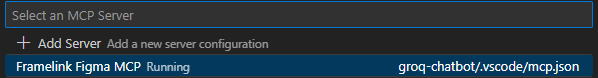
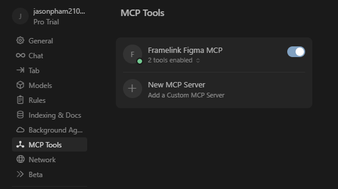
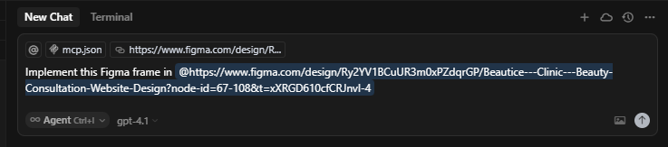
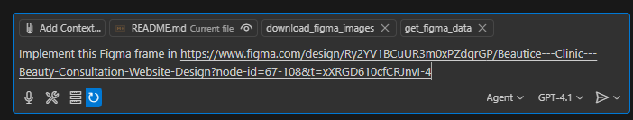

# Hướng Dẫn Nhanh: Tích Hợp GitHub Copilot & Cursor AI Agents với Figma qua Framelink MCP

Tài liệu này giúp bạn thiết lập máy chủ Framelink Figma MCP, kết nối với IDE (VSCode/Cursor), và sử dụng AI Agent để tự động tạo mã từ thiết kế Figma.

---

## 1. Lấy Mã Truy Cập Figma (Access Token)

Trước khi gửi yêu cầu đến máy chủ Framelink Figma MCP, bạn cần tạo một mã truy cập Figma:

1. Từ trang chủ Figma, nhấp vào biểu tượng hồ sơ của bạn ở góc trên bên trái và chọn **Settings** từ menu thả xuống.
2. Trong menu cài đặt, chọn tab **Security**.
3. Cuộn xuống phần **Personal access tokens** và nhấp vào **Generate new token**.
4. Nhập tên cho token, đảm bảo bạn có quyền đọc đối với **"File content"** và **"Dev resources"**, sau đó nhấp vào **Generate token**.

> 📘 Tham khảo thêm: [Hướng dẫn tạo personal access token Figma](https://help.figma.com/hc/en-us/articles/8085703771159-Create-personal-access-tokens)

---

## 2. Thêm Máy Chủ Framelink Figma MCP vào IDE

### Trên VSCode (Windows):

1. Tạo file `.vscode/mcp.json` trong workspace của bạn.

### Trên Cursor:

1. Mở **Cursor Settings** với tổ hợp phím `Ctrl + Shift + J`.
2. Chọn **MCP tools** → **New MCP servers**.

### Cấu hình mẫu:

Thay `YOUR-KEY` bằng mã truy cập Figma bạn đã tạo ở bước trên, và sử dụng cấu hình sau trong cả `cursor` và `vscode`:

```json
{
  "mcpServers": {
    "Framelink Figma MCP": {
      "command": "cmd",
      "args": [
        "/c",
        "npx",
        "-y",
        "figma-developer-mcp",
        "--figma-api-key=YOUR-KEY",
        "--stdio"
      ]
    }
  }
}
```

## 3 Khởi Động Server

- **Cursor:** Bật công tắc để reload và chạy MCP server vừa tạo.
- **VSCode:** Nhấn `Ctrl + Shift + P`, tìm `MCP: List Servers`, sau đó chọn **Start server** → chọn **"Framelink Figma MCP"**.

> ✅ **Lưu ý:** Đảm bảo server có trạng thái **"On"** trong Cursor và không còn trạng thái **"Stopped"** mà chuyển sang **"Running"** trong danh sách MCP của VSCode.

### 

### 

## 4. Mở Chế Độ Agent AI trong Cursor/VSCode (Copilot)

- Mở tab **Chat** → bật **Agent AI**.

> ⚠️ **Lưu ý:** Với Copilot, bạn cần thêm **context** bằng cách:
>
> - Chọn **Add Context** → **Tools** → Click chọn:
>   - `get_figma_data`
>   - `download_figma_image`
>     từ mục **MCP Server section**.

---

## 5. Tạo Mã Tự Động Từ Figma

1. Sao chép liên kết đến **frame** hoặc **group** trong Figma.
2. Dán liên kết đó vào trình soạn thảo của bạn (Cursor hoặc VSCode).
3. Đợi kết quả — mã nguồn sẽ được **AI Agent** tự động tạo ra.

### Ví dụ:

**Cursor:**



**VSCode:**



### Gửi request xong 📨 ngồi rung đùi 🦵 chờ kết quả thôi 😎☕!

## 5. Bước Tiếp Theo (Lưu Ý Cho Designer và Developer) 🧑‍🎨👨‍💻

Máy chủ **Framelink Figma MCP** đơn giản nhưng mạnh mẽ khi được sử dụng đúng cách.

Nếu bạn muốn nâng cao kỹ năng sử dụng MCP, hãy tham khảo hướng dẫn các - [**Best Practices**](https://www.framelink.ai/docs/best-practices) để tối ưu hóa hiệu suất.

---

## PHẦN BỔ SUNG: (vitamin tổng hợp cho anh em dev đang chiến với AI)

## 🚀 Sáng Tạo Tuyệt Vời: MCP là Gì và Vì Sao Nó Quan Trọng?

### 1. 🔍 MCP là gì?

**MCP (Model Context Protocol)** là một **giao thức mở** được thiết kế để **chuẩn hóa cách các ứng dụng truyền tải ngữ cảnh (context)** đến các **mô hình ngôn ngữ lớn (LLMs)** như GPT hoặc Claude.  
Mục tiêu của MCP là giúp AI hiểu rõ hơn về tình huống, dữ liệu và mục tiêu mà người dùng đang làm việc, từ đó tạo ra phản hồi chính xác và hữu ích hơn.

---

### 2. 🔌 Ví dụ dễ hiểu:

**Hãy tưởng tượng MCP giống như cổng USB-C trong thế giới AI.**

- Cổng **USB-C** cho phép bạn kết nối **bất kỳ thiết bị nào** (chuột, bàn phím, ổ cứng, sạc…) chỉ với **một chuẩn duy nhất**.
- **Tương tự**, MCP tạo ra **một "chuẩn chung"** để kết nối các **mô hình AI** với **dữ liệu, công cụ và bối cảnh người dùng**, bất kể bạn đang dùng IDE nào hay xử lý loại dữ liệu nào.

---

### 3. 💡 Vì sao MCP quan trọng?

- ✅ **Chuẩn hóa** cách truyền thông tin giữa ứng dụng và AI
- ✅ **Tăng độ chính xác** khi AI hiểu rõ ngữ cảnh mà bạn đang làm việc
- ✅ **Tích hợp dễ dàng** vào các công cụ phát triển như Cursor, Visual Studio Code, v.v.
- ✅ **Mở rộng khả năng** của LLMs: từ hỗ trợ lập trình đến thiết kế UI, phân tích dữ liệu, và nhiều hơn nữa

---

> ✨ _MCP giúp AI trở nên “thông minh hơn” bằng cách hiểu rõ hơn những gì bạn đang làm – một bước tiến lớn để biến AI thành cộng sự thật sự trong công việc hàng ngày._

## Tài Liệu Tham Khảo

- [Framelink](https://www.framelink.ai/)
- [VSCode MCP Server with Copilot Chat](https://code.visualstudio.com/docs/copilot/chat/mcp-servers)
- [Figma Context MCP Repo](https://github.com/GLips/Figma-Context-MCP)
- [MCP](https://modelcontextprotocol.io/introduction)

# Chúc anh chị em một ngày code + chất + chill 😎☀️🚀

## 🙏 Cảm ơn anh em đã donate, Em hứa sẽ dùng tiền đúng mục đích!


